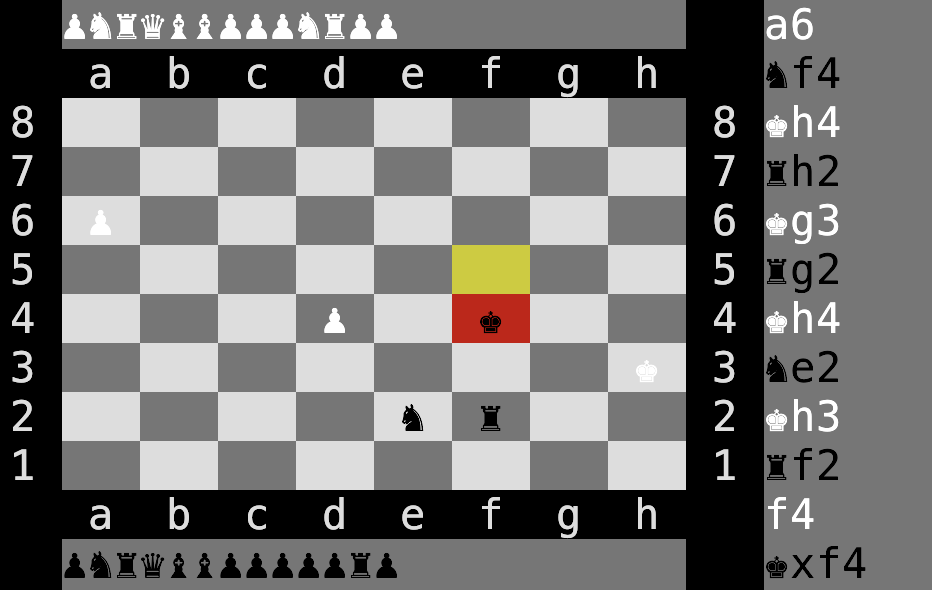

# chess



## Usage

The `chess` module is used as follows:

```python
from chess import Chess, Player
from chess.colors import COLOR

game = Chess()
player1 = Player(COLOR.white)
player2 = Player(COLOR.black)
game.add_player(player1)
game.add_player(player2)
game.log_moves_to_file(f'moves.txt') # optionally save game moves to a file as they come
game.start()

while True:
    player = game.players[game.turn]
    print(game) # print board state
    move = input(f'{player.color.name} move: ')
    player.move(*Chess.parse_move(move))
```

State can be loaded from the file saved by calling `Chess.log_moves_to_file`:

```python
from chess import Chess

game = Chess.from_file(state_path)

while True:
    player = game.players[game.turn]
    print(game) # print board state
    move = input(f'{player.color.name} move: ')
    player.move(*Chess.parse_move(move))
```

For full examples, see `hotseat.py`, `player_vs_stockfish.py` and `stockfish_vs_stockfish.py`.